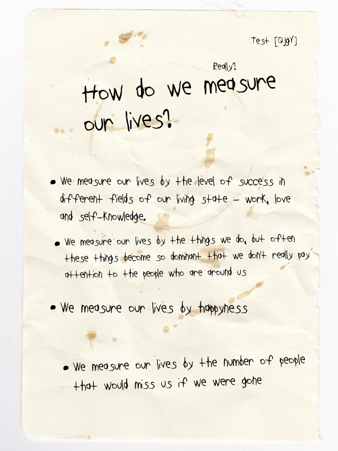

# **A Contemporary Turing Test**

### [Link to the Project](https://cturing.dei.uc.pt)

### **Context and Description**

A project developed by Pedro Churro for the Computational Design Laboratory subject in the Master's in Design and Multimedia course of Faculty of Sciences and Technology of the University of Coimbra, with the support of the professors Tiago Martins, João M. Cunha, Pedro Silva, and Sérgio M. Rebelo.

The subject's purpose was for the students to develop a design project which had programming as the key factor, and explored a theme from the 2022 edition of the International Symposium on Electronic Art. This project followed the "Human and Non-human" theme and aimed to be an exploration of Machine Learning for text generation and it's use in today's society.

### **Technologies used**

This project runs on a Node.js server with [Express](https://expressjs.com), [NeDB](https://github.com/louischatriot/nedb), [node-p5](https://www.npmjs.com/package/node-p5), [Puppeteer](https://pptr.dev), and [Twit](https://www.npmjs.com/package/twit). To run the project you will need to install Node and all these dependencies, and then run `node index.js` on the system directory.

### **Contact**

Pedro M. Churro
pchurro@student.dei.uc.pt

